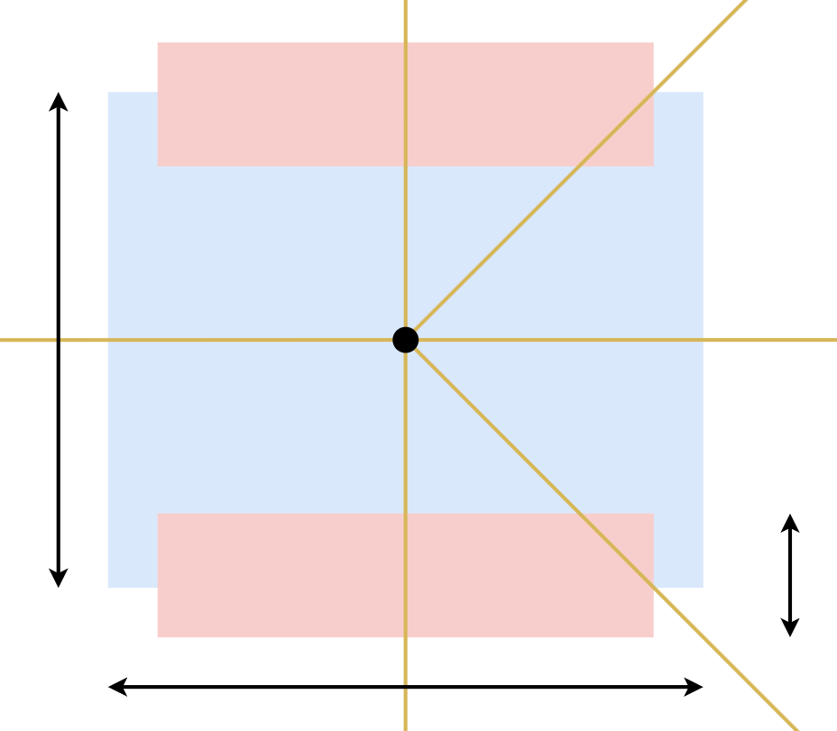
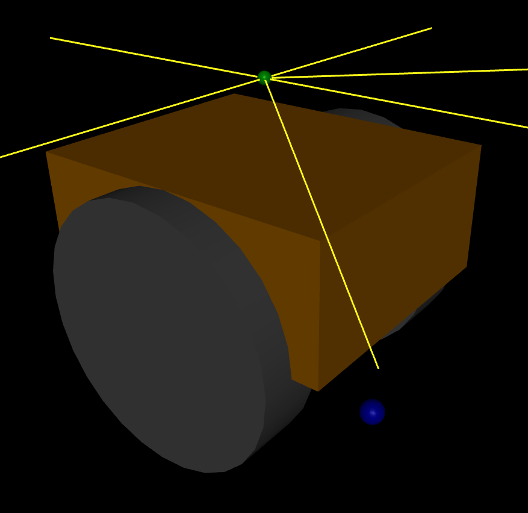
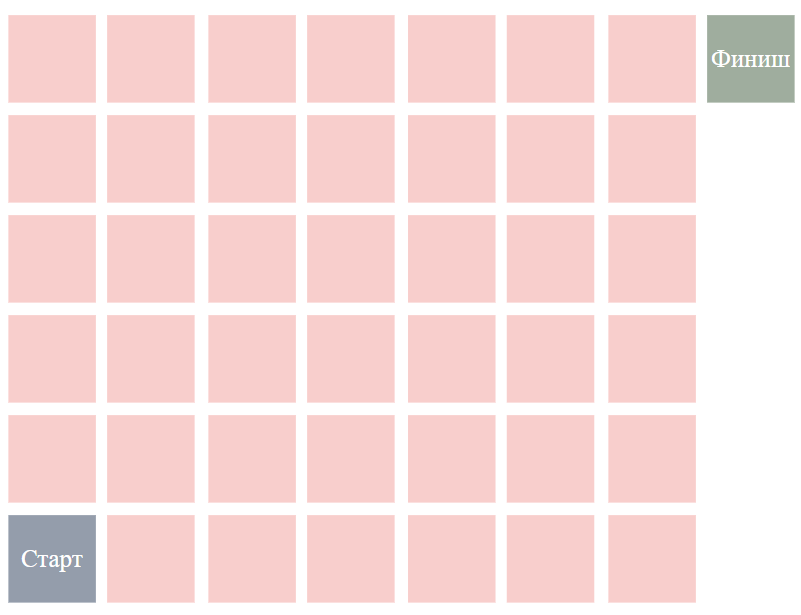
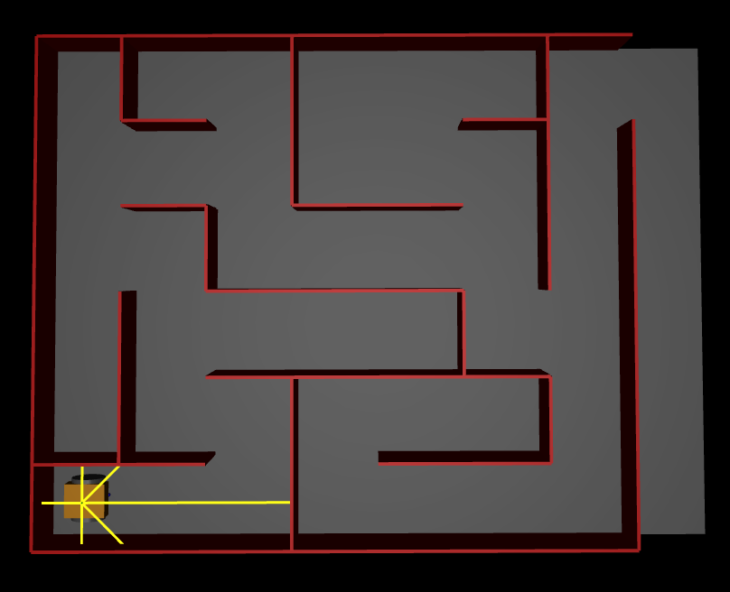
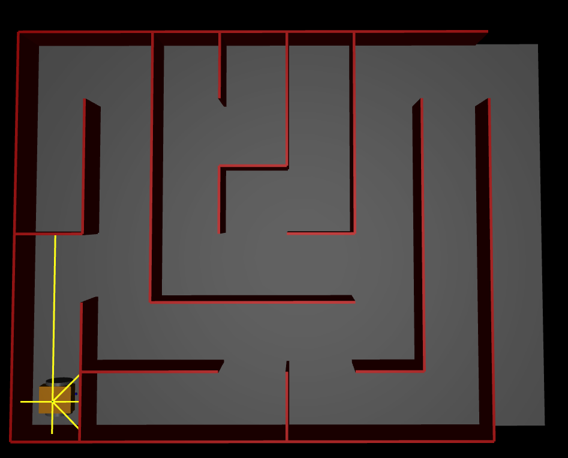
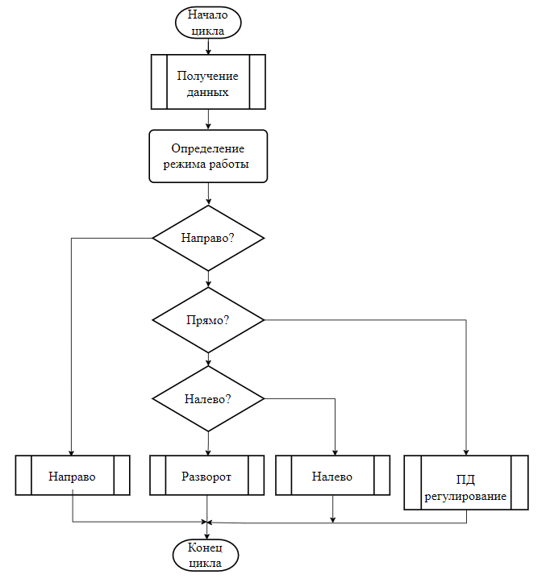

# Поиск выхода из лабиринта

**Цель работы:** Реализовать алгоритм управления мобильным роботом с дифференциальным приводом для выхода из лабиринта. <br />
**Задачи:**
 
  - Моделирование окружения (лабиринта) и робота.
  - Выбор и реализация алгоритма планирования поведения.
  - Реализация программы управления на языке Python.<br />

## Моделирование робота

В данной работе используется робот с дифференциальной схемой управления колесами. Схема робота приведена на рисунке 1 и 2.
<br />
<br />
Робот имеет следующие важные геометрические параметры: 

  - Ширирна колеи: 200 мм.
  - Радиус колеса: 100 мм.

Для определения ориентации робота на нем установлен гироскоп и 6 дальномеров: вперед, назад, вправо, влево, вправо_45, влево_45.

## Моделирование окружение

Общий вид окружения представлен на на рисунке 3. <br />

<br />
Робот появляется в клетке старта, каждая клетка имеет размер 500 мм. Целью робота является достичь клетки финиша. Между клетками могут находится стенки.
Для данной работы используется два лабиринта представленные на рисунке 4 и 5.
<br />
<br />

## Алгоритм планирования поведения

Для задачи поиска выхода из лабиринта можно использовать следующие алгоритмы:

  - Алгоритм правой стены;
  - Поиск в глубину;
  - Поиск в ширирну;
  - Flood fill.
    
Для данной задачи был выбран алгоритм правой стены, поскольку остальные алгоритмы требуют построения карты окружения для последующего поиска пути, что трудно реализовать только по дальномерам. Идея алгоритма заключается в следования вдоль правой стены до момента поиска. Проблемой алгоритма является неоптимальность процесса поиска и возможность зацикливания алгоритма при сналичии несвязанных стен. Общий вид реализуемой программы приведен ниже:


<br /> Определение наличия стены спереди осуществляется передним дальномером. Справа и слева аналогично левым и правым и 45 градусными дальномерами.

## Запуск программы

Код решения прeдставлен в папке ```src/```. Для запуска решения необходимо выполнить следующую команду: ```python src/main.py --num 1```. Здесь аргумент ```num``` может приниать значения 1..2 и влияет на выбор лабиринта.
